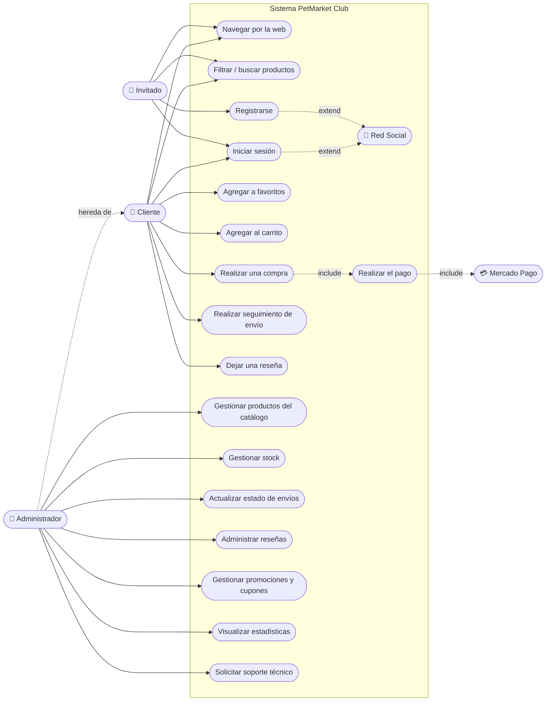

# Diagrama de Casos de Uso - PetMarket Club

```mermaid
graph LR
    %% ACTORES
    Cliente(["👤 Cliente"])
    Admin(["👤 Administrador"])
    Invitado(["👤 Invitado"])
    MP(["💳 Mercado Pago"])
    RS(["🔑 Red Social"])

    subgraph Sistema["Sistema PetMarket Club"]
        UC1(["Navegar por la web"])
        UC3(["Filtrar / buscar productos"])
        UC2(["Registrarse"])
        UC4(["Iniciar sesión"])
        UC5(["Agregar a favoritos"])
        UC6(["Agregar al carrito"])
        UC7(["Realizar una compra"])
        UC8(["Realizar el pago"])
        UC9(["Realizar seguimiento de envío"])
        UC10(["Dejar una reseña"])

        UC11(["Gestionar productos del catálogo"])
        UC12(["Gestionar stock"])
        UC13(["Actualizar estado de envíos"])
        UC14(["Administrar reseñas"])
        UC15(["Gestionar promociones y cupones"])
        UC16(["Visualizar estadísticas"])
        UC17(["Solicitar soporte técnico"])

        UC2 -.->|extend| RS
        UC4 -.->|extend| RS
    end

    %% RELACIONES INVITADO
    Invitado --> UC3
    Invitado --> UC1
    Invitado --> UC2
    Invitado --> UC4

    %% RELACIONES CLIENTE
    Cliente --> UC1
    Cliente --> UC3
    Cliente --> UC4
    Cliente --> UC5
    Cliente --> UC6
    Cliente --> UC7
    Cliente --> UC9
    Cliente --> UC10

    %% RELACIONES ADMINISTRADOR
    Admin -.->|hereda de| Cliente
    Admin --> UC11
    Admin --> UC12
    Admin --> UC13
    Admin --> UC14
    Admin --> UC15
    Admin --> UC16
    Admin --> UC17

    %% RELACIONES INCLUDE / EXTEND
    UC7 -.->|include| UC8
    UC8 -.->|include| MP
```