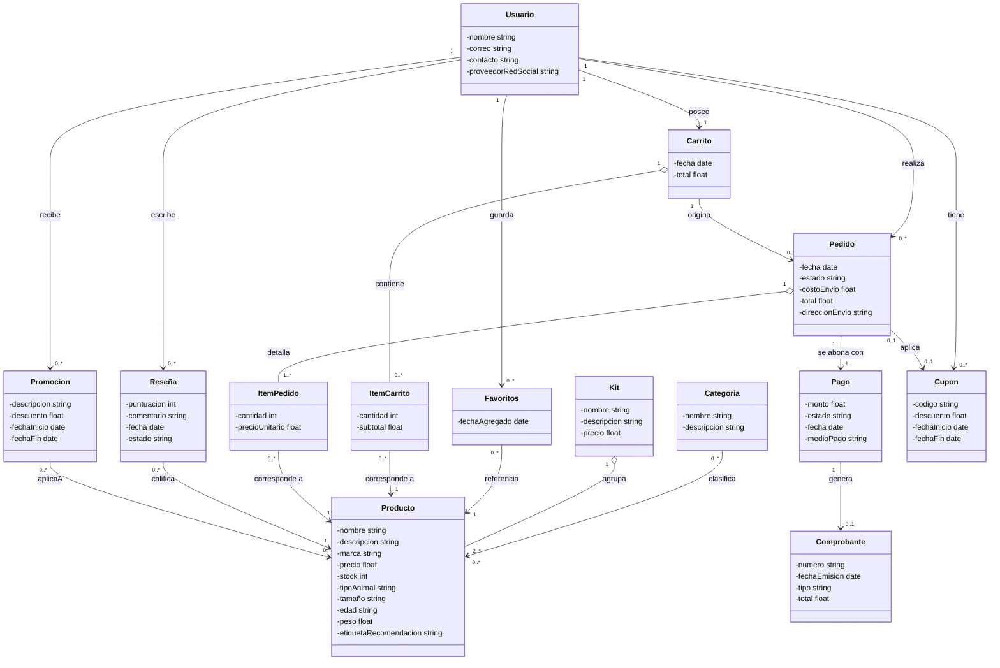

```mermaid
classDiagram

    %% USUARIOS ---------------------------
    
    class Usuario {
        -nombre string
        -correo string
        -contacto string
        -proveedorRedSocial string
    }


    %% CATALOGO ---------------------------
    
    class Categoria {
        -nombre string
        -descripcion string
    }

    class Producto {
        -nombre string
        -descripcion string
        -marca string
        -precio float
        -stock int
        -tipoAnimal string
        -tamaño string
        -edad string
        -peso float
        -etiquetaRecomendacion string
    }

    class Kit {
        -nombre string
        -descripcion string
        -precio float
    }

    Categoria "0..*" --> "0..*" Producto : clasifica
    Kit "1" o-- "2..*" Producto : agrupa

    
    %% CARRITO Y FAVORITOS ---------------------------
    
    class Carrito {
        -fecha date
        -total float
    }

    class ItemCarrito {
        -cantidad int
        -subtotal float
    }

    class Favoritos {
        -fechaAgregado date
    }

    Usuario "1" --> "1" Carrito : posee
    Usuario "1" --> "0..*" Favoritos : guarda
    Favoritos "0..*" --> "1" Producto : referencia
    Carrito "1" o-- "0..*" ItemCarrito : contiene
    ItemCarrito "0..*" --> "1" Producto : corresponde a 

    
    %% PEDIDO Y PAGO ---------------------------
    
    class Pedido {
        -fecha date
        -estado string
        -costoEnvio float
        -total float
        -direccionEnvio string
    }

    class ItemPedido {
        -cantidad int
        -precioUnitario float
    }

    class Pago {
        -monto float
        -estado string
        -fecha date
        -medioPago string
    }

    class Comprobante {
        -numero string
        -fechaEmision date
        -tipo string
        -total float
    }


    Usuario "1" --> "0..*" Pedido : realiza
    Carrito "1" --> "0..*" Pedido : origina
    Pedido "1" o-- "1..*" ItemPedido : detalla
    ItemPedido "0..*" --> "1" Producto : corresponde a
    Pedido "1" --> "1" Pago : se abona con
    Pago "1" --> "0..1" Comprobante : genera

    
    %% RESEÑAS ---------------------------
    
    class Reseña {
        -puntuacion int
        -comentario string
        -fecha date
        -estado string
    }

    Usuario "1" --> "0..*" Reseña : escribe
    Reseña "0..*" --> "1" Producto : califica

    
    %% PROMOCIONES Y CUPONES ---------------------------
    
    class Promocion {
        -descripcion string
        -descuento float
        -fechaInicio date
        -fechaFin date
    }

    class Cupon {
        -codigo string
        -descuento float
        -fechaInicio date
        -fechaFin date
    }

    Usuario "1" --> "0..*" Promocion : recibe
    Usuario "1" --> "0..*" Cupon : tiene
    Pedido "0..1" --> "0..1" Cupon : aplica
    Promocion "0..*" --> "0..*" Producto : aplicaA
```